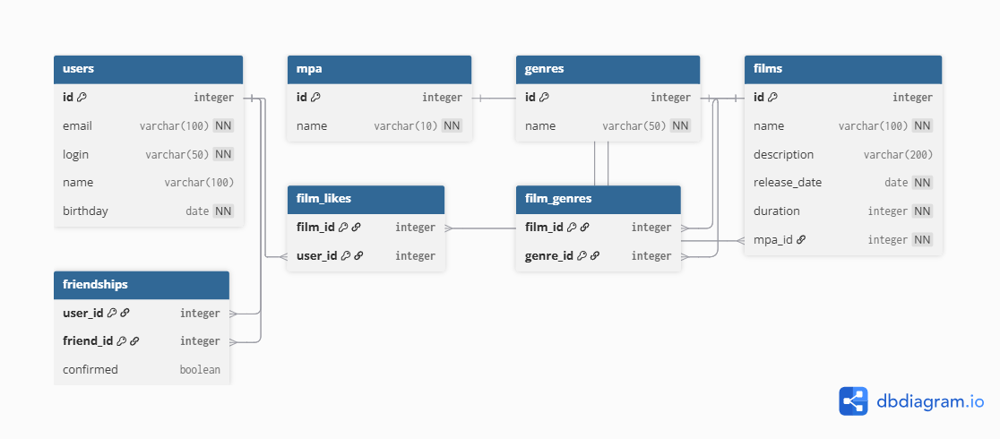

## Схема базы данных



### ER-диаграмма

Схема базы данных спроектирована с соблюдением принципов нормализации и поддерживает всю бизнес-логику приложения Filmorate.

#### Основные сущности:

**🎬 FILMS** - каталог фильмов
- `id` - уникальный идентификатор фильма
- `name` - название фильма
- `description` - описание (максимум 200 символов)
- `release_date` - дата релиза (не ранее 28.12.1895)
- `duration` - продолжительность в минутах (положительное число)
- `mpa_id` - ссылка на рейтинг MPA (обязательное поле)

**👥 USERS** - пользователи системы
- `id` - уникальный идентификатор пользователя
- `email` - электронная почта (уникальная, валидируется)
- `login` - логин пользователя (уникальный, без пробелов)
- `name` - имя пользователя (если не указано, используется login)
- `birthday` - дата рождения (не в будущем)

**🏷️ MPA** - возрастные рейтинги Motion Picture Association
- `id` - уникальный идентификатор
- `name` - название рейтинга
  - **G** - нет возрастных ограничений
  - **PG** - детям рекомендуется смотреть с родителями
  - **PG-13** - детям до 13 лет просмотр не желателен
  - **R** - лицам до 17 лет только в присутствии взрослого
  - **NC-17** - лицам до 18 лет просмотр запрещён

**🎭 GENRES** - жанры фильмов
- `id` - уникальный идентификатор
- `name` - название жанра (Комедия, Драма, Мультфильм, Триллер, Документальный, Боевик)

#### Связующие таблицы:

**🤝 FRIENDSHIPS** - дружба между пользователями
- `user_id` - инициатор дружбы
- `friend_id` - получатель запроса
- `confirmed` - статус подтверждения (true/false)
  - `false` - неподтверждённая дружба (один отправил запрос)
  - `true` - подтверждённая дружба (оба согласились)

**❤️ FILM_LIKES** - лайки фильмов пользователями
- `film_id` - ссылка на фильм
- `user_id` - ссылка на пользователя

**🔗 FILM_GENRES** - связь фильмов и жанров (многие ко многим)
- `film_id` - ссылка на фильм
- `genre_id` - ссылка на жанр

#### Принципы проектирования:

1. **Нормализация**: Все таблицы соответствуют третьей нормальной форме (3НФ)
2. **Целостность данных**: Используются внешние ключи и ограничения
3. **Производительность**: Созданы индексы для часто используемых запросов
4. **Масштабируемость**: Структура позволяет легко добавлять новые поля и связи

### Примеры основных SQL запросов

#### Получение топ N популярных фильмов
```sql
SELECT f.id, f.name, f.description, f.release_date, f.duration,
       m.name as mpa_name,
       COUNT(fl.user_id) as likes_count
FROM films f
LEFT JOIN mpa m ON f.mpa_id = m.id
LEFT JOIN film_likes fl ON f.id = fl.film_id
GROUP BY f.id, f.name, f.description, f.release_date, f.duration, m.name
ORDER BY likes_count DESC, f.id
LIMIT ?;
```

#### Получение фильма с жанрами
```sql
SELECT f.id, f.name, f.description, f.release_date, f.duration,
       m.name as mpa_name,
       STRING_AGG(g.name, ', ') as genres
FROM films f
LEFT JOIN mpa m ON f.mpa_id = m.id
LEFT JOIN film_genres fg ON f.id = fg.film_id
LEFT JOIN genres g ON fg.genre_id = g.id
WHERE f.id = ?
GROUP BY f.id, f.name, f.description, f.release_date, f.duration, m.name;
```

#### Получение общих друзей двух пользователей
```sql
SELECT u.id, u.email, u.login, u.name, u.birthday
FROM users u
WHERE u.id IN (
    SELECT f1.friend_id
    FROM friendships f1
    JOIN friendships f2 ON f1.friend_id = f2.friend_id
    WHERE f1.user_id = ? AND f2.user_id = ? 
    AND f1.confirmed = true AND f2.confirmed = true
)
ORDER BY u.id;
```

#### Получение друзей пользователя
```sql
SELECT u.id, u.email, u.login, u.name, u.birthday
FROM users u
JOIN friendships f ON u.id = f.friend_id
WHERE f.user_id = ? AND f.confirmed = true
ORDER BY u.id;
```

#### Добавление лайка фильму
```sql
INSERT INTO film_likes (film_id, user_id) VALUES (?, ?);
```

#### Добавление фильма с жанрами
```sql
-- Добавление фильма
INSERT INTO films (name, description, release_date, duration, mpa_id)
VALUES (?, ?, ?, ?, ?)
RETURNING id;

-- Добавление жанров к фильму
INSERT INTO film_genres (film_id, genre_id) VALUES (?, ?);
```